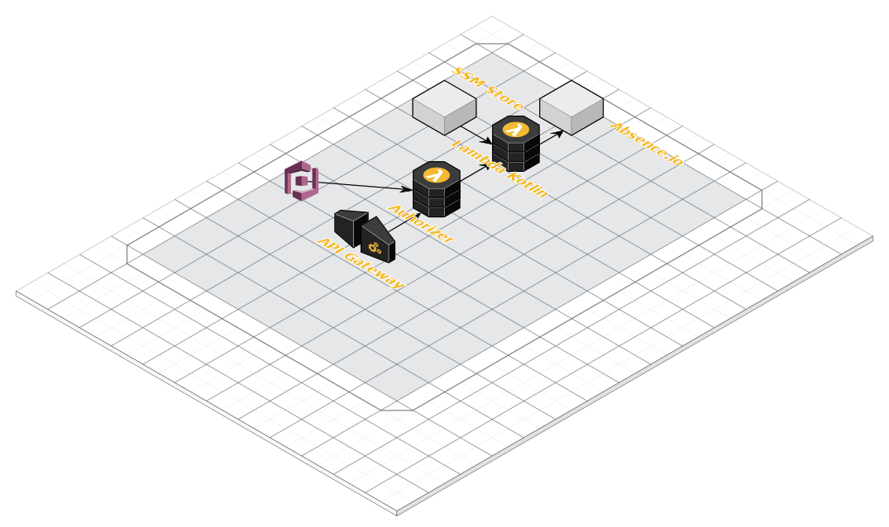

# What

This repo is just a little pet project to be able to use absence.io api with siri
It uses
 - kotlin for the main logic
 - Aws Cognito for authentication and authorization
 - Aws Api gateway for exposing the service
 - serverless to wraup evereything and create infrastructucture and deployment  
 
# Why

Altough absence has alredy an api, it needs hawk authentication , and i wanted to use it with shorcuts.
I also wanted to do it using a new languaje , and in this case is kotlin.

# Architecture.



This a Kotlin lambda attached to a api gateway taht makes calls to the absent.io api.

Aso is not a good idea to leave an open apin into the wild, it uses a conito authenticator linked a congnito user pool
to provide a secured access to the api. The congnito has been changed to acces user and pass (instead of the default UI 
validation wich makes no sense in this case)

Also the congito keys are stored in the SSM param store , and deployed as env variables in the lambdas. This way
no credential is save in the code


# How

- Add credentials to the ssm store: key and id

- create a use and a add it to cognito

- By default , congito user is "NEW_PASSWORD_REQUIRED", so we need to do that. 
we will use the amazon cli to the validation:
```aws cognito-idp admin-respond-to-auth-challenge 
   --user-pool-id USERPOOLID --client-id CLIENTID 
   --challenge-responses "NEW_PASSWORD=LaLaLaLa1234!!!!,USERNAME=me@example.com" 
   --challenge-name NEW_PASSWORD_REQUIRED 
   --session "YourLongSessionToken"
   ```
- Run  ```./gradlew serverless deploy```  